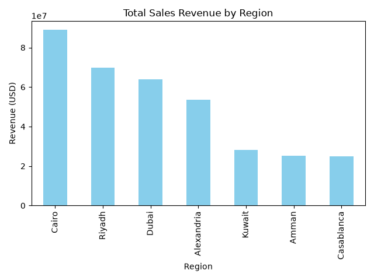

# marketing-sales-analysis
Data analysis project predicting sales revenue from marketing, customer, and digital features using Python and Pandas.
## Results
- Cairo generates the highest total revenue ($88.9M), followed by Riyadh ($69.9M) and Dubai ($64.0M).
- However, average revenue per sale is nearly identical across all regions (~$5,800-$6,000).
- Cairo's lead comes entirely from transaction volume (14,984 sales) rather than higher-value purchases — it has roughly 3.6x more transactions than the lowest region, Casablanca.

- Marketing budget shows a strong positive correlation with sales revenue (r = 0.73), suggesting marketing spend is a meaningful driver of sales.

